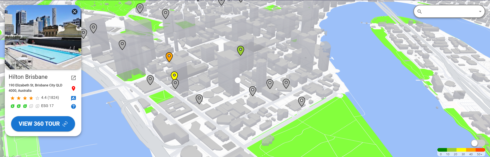

# Virtual Sustainability Tour of Brisbane

## Demo





## 🛠 Technologies
Frontend: 

 


Backend:


Testing & CI:


## Usage

Clone and start this project

```bash
  git clone 
  cd web-application-project-techtitans
  cd tecttitans-app // navigate to frontend
  npm i // install dependencies
  npm start
```
    